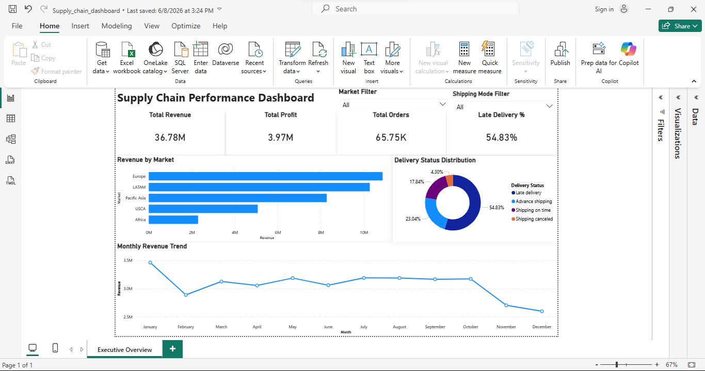
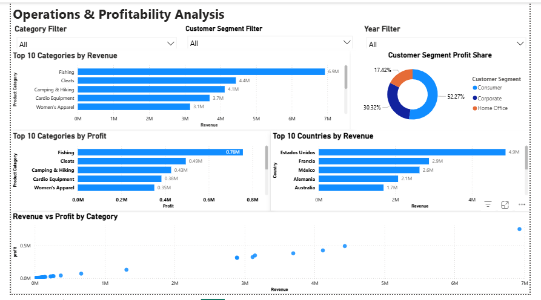

# Supply-Chain-Performance-Analytics

## Project Overview

This project analyzes supply chain operations, revenue performance, profitability, customer segments, product categories, and delivery performance using SQL, Python, and Power BI.

The objective was to identify operational inefficiencies, evaluate profitability drivers, analyze market performance, and monitor delivery effectiveness through an interactive dashboard.

---

## Business Questions

- Which markets generate the highest revenue and profit?
- Which product categories contribute most to revenue and profitability?
- How do customer segments impact business performance?
- What is the current late delivery rate?
- Which shipping methods perform best?
- How does revenue trend over time?
- Which countries contribute the most revenue?

---

## Tools Used

- SQL
- Python (Pandas)
- Power BI

---

## Data Preparation

### SQL
- Performed business analysis using aggregations and window functions
- Analyzed revenue, profit, customer segments, categories, shipping performance, and delivery status

### Python (Pandas)
- Loaded and inspected dataset
- Checked missing values
- Checked duplicate records
- Validated data types
- Performed exploratory data analysis (EDA)

### Power BI
- Built KPI cards
- Created interactive filters
- Designed executive and operational dashboards
- Developed revenue, profit, delivery, and customer segment visualizations

---

## Key Insights

### Market Performance

- Europe generated the highest revenue among all markets.
- LATAM and Pacific Asia were strong secondary contributors.
- Africa contributed the lowest revenue.

### Profitability Analysis

- Total Revenue: 36.78M
- Total Profit: 3.97M

### Product Analysis

- Fishing generated the highest revenue and profit among product categories.
- Cleats and Camping & Hiking were also major contributors.

### Customer Segment Analysis

- Consumer customers generated the largest share of profit.
- Corporate and Home Office segments represented smaller but significant contributions.

### Delivery Performance

- Late Delivery Rate: 54.83%
- On-time deliveries accounted for a significantly smaller share.

**Business Insight:**  
The high late-delivery percentage indicates a major operational challenge and highlights opportunities for logistics optimization and shipping process improvements.

---

## Dashboard Preview

### Executive Overview



### Operations & Profitability Analysis



---

## Sample SQL Analysis

### Market Revenue Ranking (Window Function)

```sql
SELECT
    Market,
    ROUND(SUM(Sales),2) AS Revenue,
    RANK() OVER(
        ORDER BY SUM(Sales) DESC
    ) AS Revenue_Rank
FROM orders_staging
GROUP BY Market;
```

---

## Skills Demonstrated

- SQL Aggregations
- Window Functions
- Business KPI Analysis
- Data Cleaning
- Exploratory Data Analysis (EDA)
- Revenue & Profitability Analysis
- Supply Chain Analytics
- Logistics Performance Analysis
- Customer Segment Analysis
- Interactive Dashboard Development
- Business Insight Generation
- Power BI Reporting

---

## Repository Structure

```text
Supply-Chain-Inventory-Analytics/
│
├── README.md
├── supply_chain_dashboard.pbix
├── supply_chain_dashboard_1.png
├── supply_chain_dashboard_2.png
├── supply_chain_analysis.sql
└── supply_chain_eda.ipynb
```

---

## Project Files

### Power BI Dashboard
[supply_chain_dashboard.pbix](./Supply_chain_dashboard.pbix)

### SQL Analysis
[supply_chain_analysis.sql](./supply_chain_analysis.sql)

### Python EDA Notebook
[supply_chain_eda.ipynb](./supply_chain_eda.ipynb)

---

## Business Takeaway

This analysis revealed strong revenue concentration in Europe, high-performing product categories, and a significant late-delivery challenge. The findings can support operational improvements, logistics optimization, profitability enhancement, and strategic decision-making.

The project demonstrates an end-to-end analytics workflow using SQL, Python, and Power BI to transform raw supply chain data into actionable business insights.
